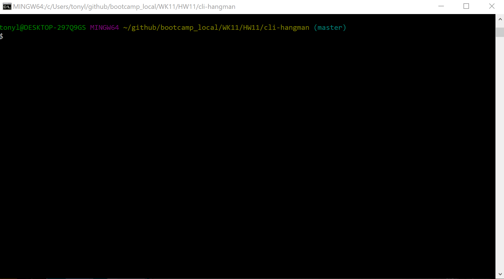

# cli-hangman
This repo is a *Halloween Version* of the classic hangman game, with a Command Line Interface (CLI).  It cycles through a list of Halloween movie villains and asks the player to guess the villain by clicking a key.  The game displays the following:
1. Instructions
1. Letters Guessed
1. Incorrect Guesses
# Demo
 
# Setup
index.js is the main entry point for the app.  In order to run the app, you will need to clone this repository and install all required technologies listed below.
# Required Technologies
1. [Node.js](https://nodejs.org/en/) 
2. [NPM](https://www.npmjs.com/get-npm) 
3. [Git & Git Bash](https://git-scm.com/downloads) 
# Installation Steps
1. Clone the cli-hangman repo
2. Install all required technologies
3. In bash, change the current directory to the cli-hangman and install all modules from the package.json, using the following command:
    1. install i [Enter]  
# Execute Program
1. Open bash, and execute the following commands in the cli-hangman directory:
    1. node index.js [Enter]
    2. Follow the instructions at the command prompt
# Use
This repo is available for public non-commercial use only.
# Goal
The goal of this project was to create an object oriented JavaScript game using a command line interface.  